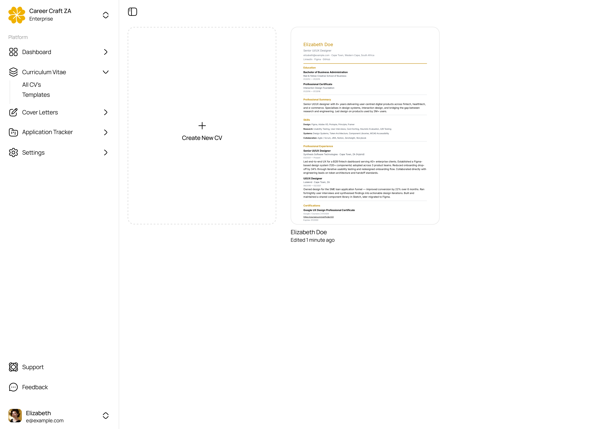
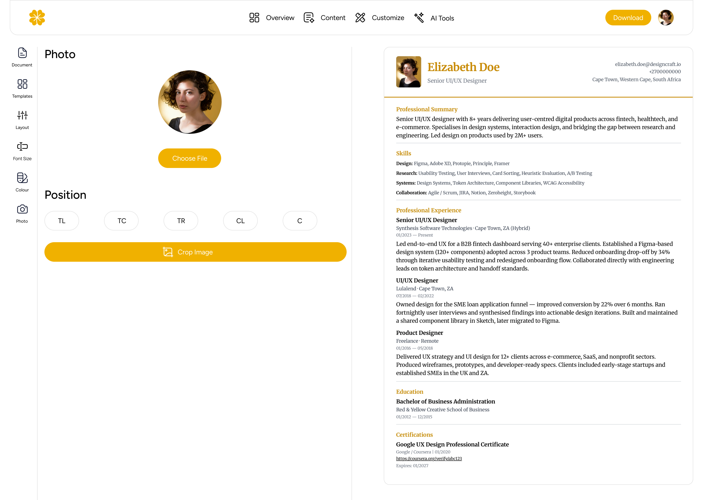
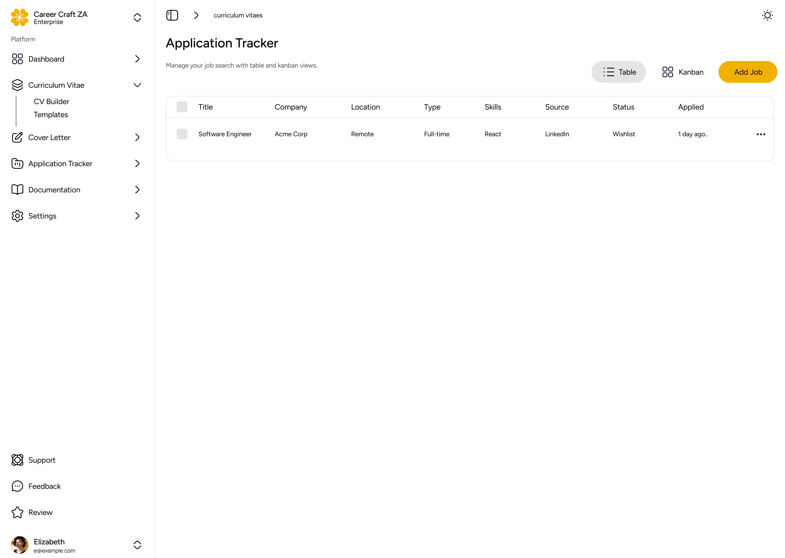

# CareerCraft

> Build polished, ATS-friendly CVs with powerful customization, modern templates, and instant PDF downloads.

CareerCraft is a full-featured CV builder and career management platform. Create professional CVs using 19 ATS-compliant templates, manage job applications with a built-in CRM, generate cover letters, and leverage AI tools – all in one place.

## Screenshots

| Dashboard | Customize | Application Tracker |
|-----------|-----------|-------------------|
|  |  |  |

## Features

### CV Builder
- **19 ATS-compliant templates** across 6 categories: Simple, Modern, Creative, Photo, Compact, First Job
- **3-panel editor** with live page-based preview (zoom, pagination, A4/US Letter sizing)
- **Rich text editing** via TipTap (bullet points, formatting, inline images)
- **Drag-and-drop** section reordering and entry sorting
- **Customization**: fonts, colors, spacing, headings, dividers, page format, header layout, photo upload (UploadThing)
- **PDF / DOCX / JSON** export
- **Undo/redo** (Ctrl+Z/Y, 50-level history) with autosave
- **Section visibility** toggles and custom section titles

### AI Tools
- Improve bullet points – rewrite for impact and achievement-orientation
- Generate professional summaries from experience details
- Suggest relevant skills for a job title
- Grammar and style checking
- ATS Score Checker – score your CV against a job description

### Cover Letters
- Content editor with AI-powered generation
- Customize styling (fonts, spacing, colors)
- Live preview with dedicated templates

### Job Tracker CRM
- **Table + Kanban** dual-view job application tracking
- **5 pipeline columns**: Wishlist, Applied, Interviewing, Offer, Rejected
- **Persistent details panel** with Overview, Timeline, Contacts, Interviews, Offers tabs
- **Advanced filtering** by status, type, work model, source, date, follow-up, interviews
- **Saved searches**, bulk actions (status/archive/restore/delete)
- **Insights widget** with pipeline bar, response rate, interview conversion metrics
- **AI tools**: cover letter generation, keyword extraction, interview question prediction
- CV/cover letter linking to applications

### Other
- **Public sharing** with view/download tracking
- **Account & billing** pages with upgrade simulator
- **Admin panel** for user management, feedback, and reviews
- **Responsive** – desktop 3-panel, tablet toggle, mobile-optimised

## Tech Stack

| Layer | Technology |
|-------|-----------|
| **Framework** | Next.js 16 (App Router, Turbopack) |
| **Language** | TypeScript 5 |
| **UI** | React 19, shadcn/ui, Tailwind CSS 4, Framer Motion 12 |
| **Icons** | Hugeicons |
| **State** | Zustand 5 |
| **Database** | PostgreSQL, Prisma 7 ORM |
| **Auth** | Better Auth (credentials + Google/GitHub OAuth) |
| **Editor** | TipTap 3 (rich text) |
| **Drag & Drop** | dnd-kit |
| **Forms** | react-hook-form + Zod |
| **Export** | Playwright (PDF), docx (DOCX), JSON |
| **Uploads** | UploadThing (photo upload) |
| **AI** | OpenAI-compatible API (Gemini, etc.) |
| **Payments** | (simulated) Prisma plan management |

## Getting Started

### Prerequisites

- [Bun](https://bun.sh) 1.x
- PostgreSQL database (local or [Neon](https://neon.tech))

### Installation

```bash
git clone <repo-url>
cd career-craft-za
bun install
```

### Environment Variables

Copy `.env.example` to `.env` and configure:

```bash
cp .env.example .env
```

| Variable | Required | Description |
|----------|----------|-------------|
| `DATABASE_URL` | Yes | PostgreSQL connection string |
| `NEXT_PUBLIC_BASE_URL` | Yes | App base URL (`http://localhost:3000` for dev) |
| `GOOGLE_CLIENT_ID` | Optional | Google OAuth client ID |
| `GOOGLE_CLIENT_SECRET` | Optional | Google OAuth client secret |
| `GITHUB_CLIENT_ID` | Optional | GitHub OAuth client ID |
| `GITHUB_CLIENT_SECRET` | Optional | GitHub OAuth client secret |
| `AI_API_KEY` | Optional | OpenAI-compatible API key for AI features |
| `UPLOADTHING_TOKEN` | Optional | UploadThing token for photo uploads |
| `RESEND_API_KEY` | Optional | Resend API key for email verification |

### Database Setup

```bash
# Push schema to database
bunx prisma db push

# Seed with admin user
bun run db:seed
```

### Development

```bash
bun run dev
```

Open [http://localhost:3000](http://localhost:3000).

### Commands

| Command | Description |
|---------|-------------|
| `bun run dev` | Start development server |
| `bun run build` | Production build |
| `bun run start` | Start production server |
| `bun run typecheck` | TypeScript type checking |
| `bun run lint` | ESLint |
| `bun run format` | Prettier format |
| `bun run db:seed` | Seed database |

## Project Structure

```
app/
├── (main)/(dashboard)/  # Dashboard pages (CVs, cover letters, job tracker, settings)
├── (auth)/              # Login/signup pages
├── (marketing)/         # Landing, about, pricing, templates
├── api/                 # API routes (auth, PDF, uploadthing, AI)
├── curriculum-vitae/    # Editor routes (content, customize, ai, overview)
├── cover-letter/        # Cover letter editor routes
└── r/[shareId]/         # Public shared CV page

components/
├── content/             # Content tab (personal details, sections, entries)
├── customize/           # Customize tab (fonts, colors, layout, photo, links)
├── curriculum-vitae/    # CV templates + preview
├── cover-letter/        # Cover letter editor + templates
├── application-tracker/ # Job tracker CRM (table, kanban, details, filters)
├── home/                # Landing page components (hero, navigation)
├── admin/               # Admin panel components (users, feedback, reviews)
├── editor/              # Editor shell, panels, autosave
├── layout/              # App sidebar, nav, team switcher
├── forms/               # User feedback/review forms
└── ui/                  # shadcn/ui components

lib/
├── actions/             # Server actions (CV, AI, jobs, admin, account, feedback)
├── editor/              # Editor types, Zustand store, dummy data
└── validations/         # Zod schemas

prisma/
└── schema.prisma        # Full data model
```

## Templates

19 ATS-compliant templates across 6 categories:

| Category | Templates |
|----------|-----------|
| **Simple** | CleanLine, EditorialRule, StructuredPro, CentredSerif |
| **Modern** | SidebarSlate, AccentBand, SplitHead, GradientCap |
| **Creative** | RuledEditorial, BoldStamp, SidebarInk |
| **Photo** | PhotoHeaderFloat, PhotoCentred |
| **Compact** | ExecFormal, DenseTwoCol, CondensedRule |
| **First Job** | GraduateFirst, StudentSidebar, CleanStart |

All templates consume every CV config field: font family, content width, dividers, heading style/weight, section icons, page format, font scale, spacing, accent color, photo, entry dates/location, header layout, entry style, and footer.

## License

Private / All rights reserved.
